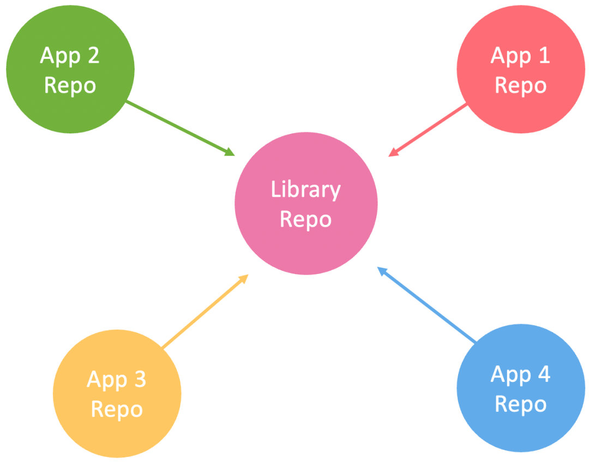
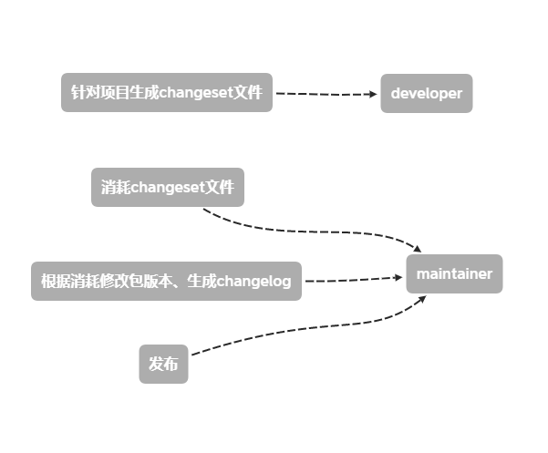
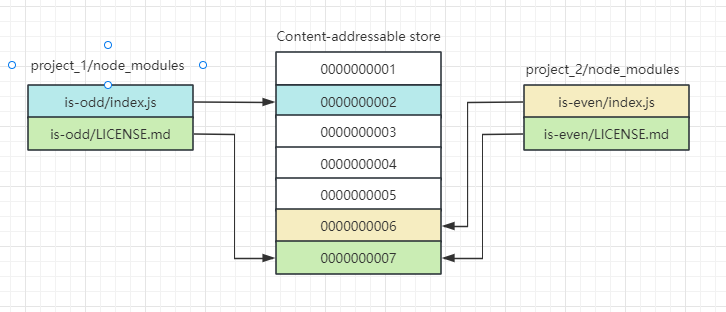
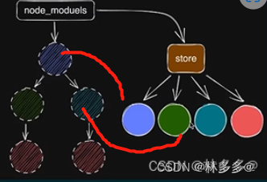
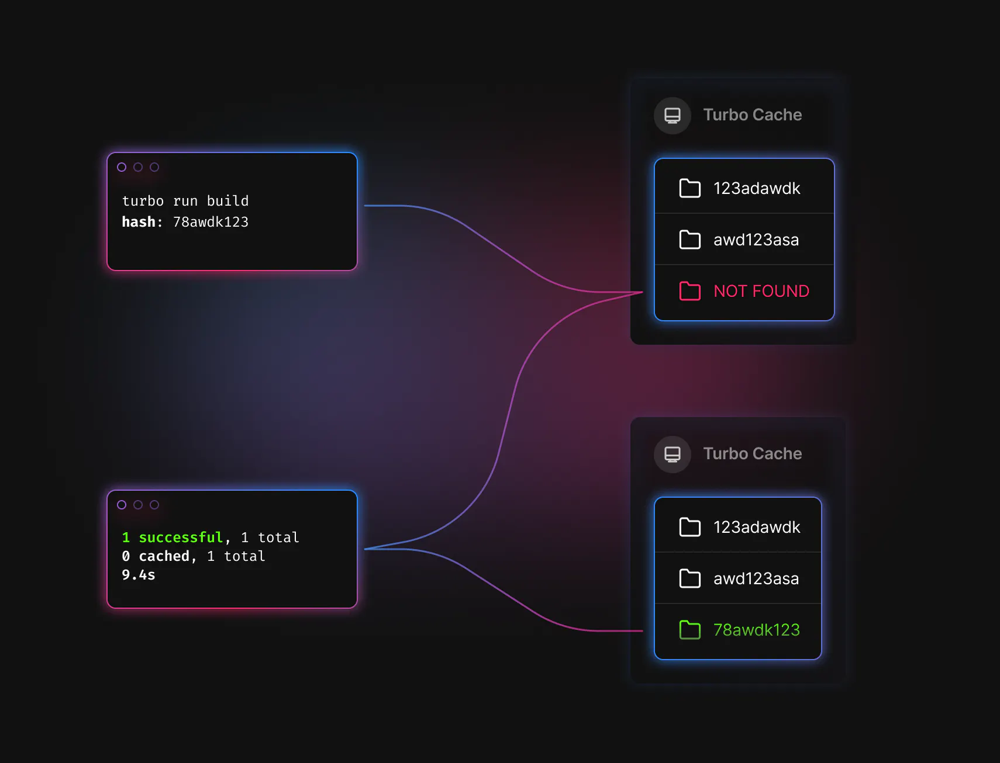
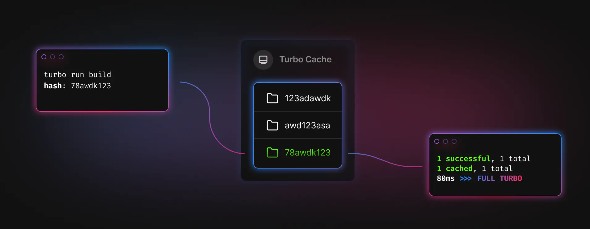
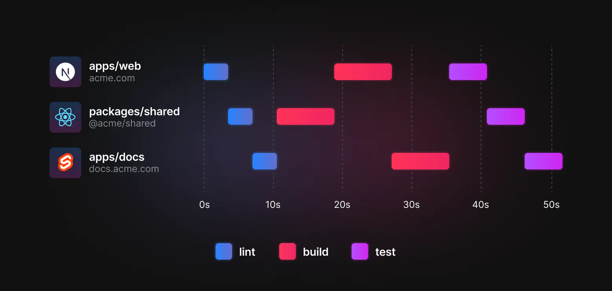
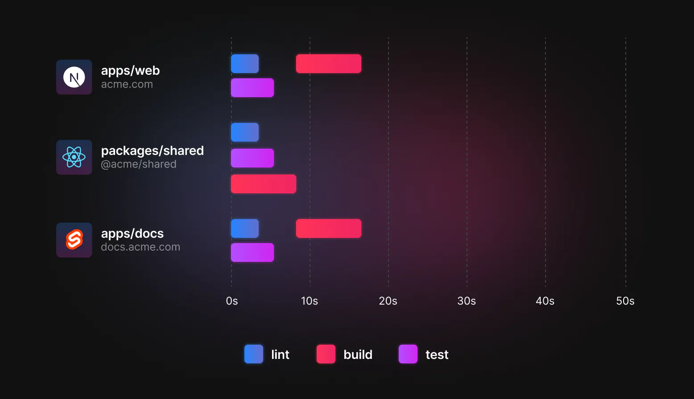
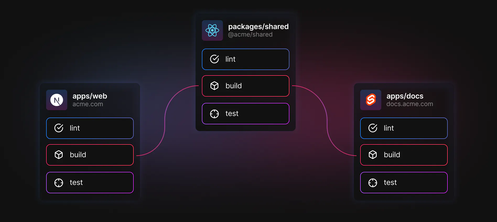
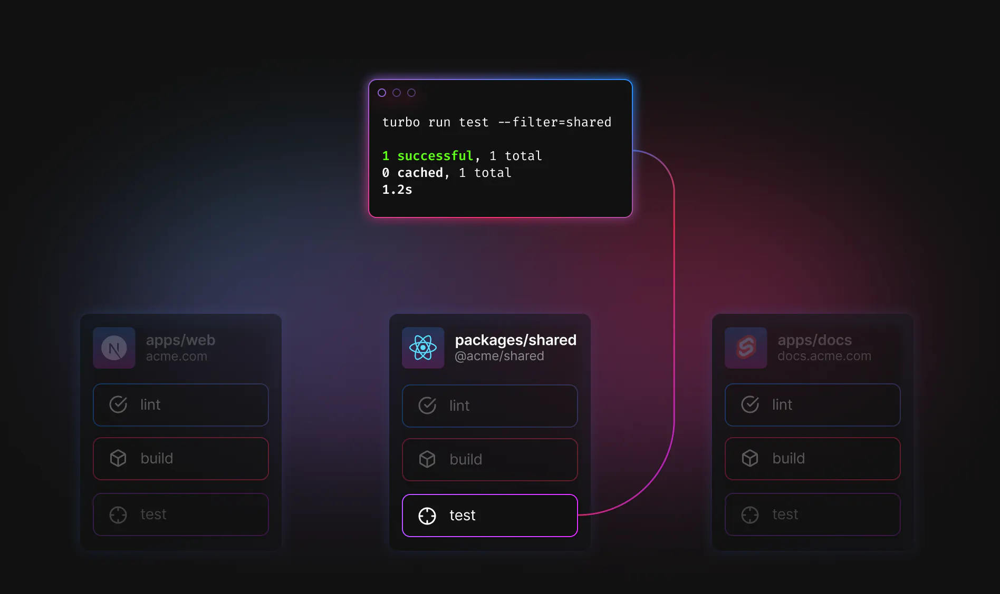

# 业务项目使用monorepo管理实践

## monorepo概念
简单来说，monorepo项目就是**将多个独立的代码仓库通过一个仓库管理**。然而他不是将所有的代码都放在`./src`文件夹这张的代码合集，相反monorepo仓库中的应用都被分割到一个个的模块中，可以把这些小模块叫做子项目（或者子应用），而且子项目之间也存在着依赖关系。例如`EthereumJS`库中代码目录结构是这样的:


与之相对应的是常用的**polyrepo架构**方式，每一个业务项目使用一个单独的仓库，但是把一些工具、公共组件、主题、脚手架等基建都剥离到新的独立仓库中维护，然后通过npm的方式去共享。以下是两个架构方式的优劣对比：

| 架构 | 优势 | 劣势 |
|:----|:----|:----|
| polyrepo | · 便于代码复用，研发效率提升 <br/> ·业务和人员的划分更加明确 | · 共同依赖的组件管理混乱 <br/> · 项目基础架构和配置不好复用 |
| monorepo | · 公共依赖关系比较清楚便于同一版本 <br/> · 各个子项目的构建方式及基础配置可以统一 | · 仓库操作权限不好收口 <br /> · 项目体积增大后以来安装比较费时 |

## 现状
多个且在持续增加的业务项目，为了降低项目的重复建设成本，结合业务视角每个工作台的核心逻辑列表交互信息查询等大体相同。而在工程管理层面，不同的人员负责不同的项目，导致相同的代码逻辑却划分在不同的工程中。每当迭代产生时需要多次开发，效率低，且带来了更高的维护成本，并且项目之间的依赖如 eslint tsconfig 等无法统一。
为了解决上述问题，通过建设业务组件库，对大量通用业务场景进行封装，也就是使用polyrepo架构。


### 技术架构
**在组件和模块的共享方面**，在项目复杂度高的情况下带来的问题：
- 模块：

· **开发效率底下**，通常调试组件至少启动两个项目，通过`npm link`方式连接;
· **部署时间长**，首先要本地发包，然后再部署项目，流程繁琐；
· 发包的形式导致组件迭代升级的影响面评估困难，在项目中同一组件的版本不统一，容易导致线上事故。
- 通用能力：

· 单独项目使用单独项目的上线流程，导致**重复建设或者无法快速共享到新的项目中**；
· 基础规范不统一，各个项目规范统一性差；

总结： **由于应用之间的物理割裂造成了研发整体的低效**，当前的项目管理、组件模块方式已经无法满足提效的需求；

## 优化目标
综上所述，我们该如何使用技术驱动业务的高效迭代？在现有的架构现状和monorepo架构的调研分析后，希望通过**项目层面的架构升级monorepo，解决项目间割裂带来的研发低效，在不变更项目逻辑的前提下，实现一下技术目标：**

1. 降低开发部署成本、更好的复用：
2. 降低项目的维护成本，通用能力拉齐；
3. 保持原有的项目开发流程不变化；

## Monorepo 工具链选用
### 核心能力
完整的monorepo项目方案，他配套的工具通常包含几个能力，依次是，项目依赖管理、包版本管理、构建管理。常用工具如下：

| 项目 | 常用工具 |
|--|--|
|项目依赖管理| npm(v7以上)、yarn、pnpm |
| 包版本管理 | lerna、 Changesets |
| 构建管理 | lerna、Turbo、Rush、Lage |

### 项目依赖管理

如果我们使用monorepo的话，通常在项目的顶层会有一个`package.json`文件，对应的子应用中也有对应的`package.json`文件，如果使用`npm i`命令并不能让所有的依赖安装进行，这里有一个新的方案**workspace**，可以支持多种子项目依赖的同步安装，这是包管理工具自身提供的协议以及cli命令，他就可以对多包仓库的依赖安装完美支持。

需要注意的是，npm v7版本（nodejs 15.x.x之后）才支持workspace，yarn和pnpm则所有版本均支持，但是他们之间的包管理形式、安装效率上还是有些不同的。
- [yarn workspace](https://classic.yarnpkg.com/en/docs/workspace)
- [pnpm workspace](https://pnpm.io/workspaces)
- [npm workspace](https://docs.npmjs.com/cli/v7/using-npm/workspaces)

### 包版本管理
版本管理工具主要用于monorepo中的公共依赖包进行版本控制与自动更新，比如lerna支持自动处理包版本，配合插件生成包的changelog以及发布包等等功能，在社区中yarn + lerna在monorepo项目的实践中具有统治地位。但是lerna也有众多问题，例如：
1. lerna中hooks执行顺序混乱
2. 自动更新版本仍需要手动调整
3. 不支持pnpm workspace

还有另外一个工具`changesets`，也可以用于monorepo项目下子项目的版本更新、changelog生成、包的发布，它本身也是一个轻量级的工具，需要**完全手动维护包版本的管理**。在changesets工作流会将开发者分位两类人，一类是项目的维护者，还有一类是项目的开发者，职责可以看下图流程：


### 构建管理
在使用monorepo项目时，项目中子应用以及其他依赖的子包都需要独立的构建流程，项目发布时需要通过任务调度完成依赖的安装、子包的构建、子应用的部署等步骤。例如lerna提供了命令编排的能力，用户可以用它完成整套构建发布流程。

其实比较成熟的框架还有nx、rush、turborepo等等工具，其中terborepo除了提供命令的编排能力，还提供了增量构建的能力，能大幅缩短命令的执行耗时。

最后看一下社区中比较成熟的monorepo技术选型：

|项目|技术选型|
|--|--|
|React|yarn workspace|
|Vue/Vite|pnpm workspace yarn|
|Angular|Bazel（跨语言、目前最完善的方案）|
|babel|yarn workspace|

## 技术选型
在介绍我们的技术方案之前需要先对以下相关的技术进行介绍，帮助我们理解整体方案。

### pnpm
#### 快速 & 高效
使用 npm 时，以来每次被不同的项目使用，都会重复安装一次。而使用pnpm时，以来会被存储在内容可寻址的存储中。因此，磁盘上节省了大量空间，这与项目和依赖项数量成正比，并且安装速度要快得多！[pnpm精读](https://zhuanlan.zhihu.com/p/553804414?utm_id=0)



同时 pnpm 的执行安装顺序为 **依赖解析 -> 目录结构计算 -> 链接依赖项** 对比传统的 npm **解析 -> 获取 -> 将依赖项写入** 也要快的多。


**支持 monorepos**

pnpm 内置支持单仓库多包，同时能通过 **pnpm-workspace.yaml** 及 **workspace:\*** 支持同仓库包引入。


**严格**

使用 npm 或 Yarn 安装依赖项时，所有的包都被提升到模块目录的根目录。这样就导致了幽灵依赖的问题，比如你的项目中没有引入`mount`却能够在项目中直接使用。pnpm 使用符号链接将项目的直接依赖项添加到模块目录的根目录中。而间接依赖则放入 **node_modules/.pnpm** 中。



<span style="color:#333; text-size: 12px;">并且使用 pnpm 可以解决 Umi 项目 mfsu 在 Monorepo 下由于node_modules层级问题无法启动的问题</span>

[官方链接](pnpm.io/zh/motivation)

### Turborepo
Turborepo 是一个针对Javascript和Typescript代码库优化的智能构建系统。采用`go语言`实现，在语言层面上就具有一定的性能优势。可以尽快的运行你的代码库任务比如**lint，build和test**，提高 Monorepo 项目的构建速度。Turborepo使用缓存在增强您的本地构建并加速您的CI。

#### 缓存任务
每个JavaScript或Typescript代码库都需要运行 package.json 脚本，例如**build、test、dev**，在Turborepo中，我们称这些为任务，Turborepo可以缓存你的任务的结果和日志-从而为慢速任务带来巨大的加速。

假设您build使用Turborepo运行任务**turbo run build**：




- Turborepo 将**评估您任务的**输出并将它们**转换为hash**（例如图中 78awdk123）
- **检查本地文件系统缓存**是否有以hash命名的文件
- 如果Turborepo没有为计算出的哈希找到匹配的缓存，将**执行任务**
- 任务结束后，Turborepo**会将所有的输出**（包括文件和日志）保存到缓存中

假设在不更改任何输入的情况下再次运行该任务：



- 哈希**将是相同的**，因为**输入**没有改变（例如78awdk123）
- Turborepo将在其缓存中找到该hash的缓存文件
- Turborepo**不会运行任务，而是会重放输出**

_Turborepo可以通过从不重复执行相同的任务来节省大量的时间，但是有一个问题--**缓存在你的机器本地**。当您使用CI时，这可能会导致大量的重复工作。因此Turborepo也提供远程缓存的功能，但是要配合**Vercel**的远程服务使用_

#### 多任务并行处理
正常Monorepo中运行任务的方式可能未优化，Turborepo通过智能调度加速他们，最大限度的减少空闲CPU。

假设我们想要在所有工作区中运行所有任务，在类似的工具**yarn**中，可能会运行如下脚本：



当我们运行 Turborepo 时是**在所有可用的CPU上执行尽可能多的任务**，这意味着我们的任务运行如下：



#### 任务管道
每个monorepo都有两个主要构建块：**工作区**和**任务**，假设您有包含**三个工作区**的monorepo，每个工作区有**三个任务**：



在这里，两者apps/web都apps/doc使用packages/shared。事实上当他们被构建（通过build）时，**它们需要先将packages/shared构建**。
在 Turborepo 中 我们可以通过其配置文件管理这些构件中的依赖关系：
```json
turbo.json
{
  "$schema": "https://turbo.build/schema.json",
  "pipeline": {
    "build": {
      // 如果一个 workspace 的 package.json 中的 dependencies 和 devDependencies 依赖其他 workspace
      // 那么在这个 workspace 的 build 执行前会先将其他依赖 worksapce 的 build 执行
      "outputs": [".next/**", "!.next/cache/**", ".svelte-kit/**"],
      "dependsOn": ["^build"]
    }
  }
}
```

Monorepo 可以包含多个 workspace。 Turborepo默认情况下，会从存储库的根目录运行将**build命令在所有可用的Workspace中执行**，如果需要执行单个命令可以使用``--fliter``标志，选择想要执行的任务。



_Turborepo 项目大多有两个工作区，apps作为子项目的存放区，packages作为公共组件的存放区_

[Turbo官方文档](https://turbo.build/)

### Changeset
changeset 用于帮助人们进行项目版本管理和日志更新，并更具提供的信息发布新版本的包，并且Changesets专注于解决Monorepo的问题，并使Monorepo中项目依托的包保持最新，使更改包组变得容易。

常用命令：
```js
changeset add // 新增changeset 文件
changeset version // 更新包版本、生成 CHANGELOG.md
changeset publish // 包发布
```

## Monorepo 项目实践
### 关键问题
#### 基础依赖
monorepo 项目使用 Pnpm 进行依赖管理，与npm命令稍有不同。同时在以来安装上，由于pnpm对依赖要求严格**幽灵依赖**的问题必须要注意。同时对Node版本有所要求需要**>=14.0.0**

#### 项目开发
Monorepo项目的本地开发流程需要重新设计，公共组件的构建、发布需要重写修改。项目的基础规范 tsconfig eslint等需要统一。

#### 项目构建
**项目构建的方式目前还是依赖于项目原有的构建方式，只在monorepo的根目录做了一层拦截调用**，由于使用monorepo统一构建，构建后代码文件在同一目录下，构建脚本需要修改，将项目输出的dist或output文件提取到根目录下方便部署。

### 应用开发
使用Monorepo后，项目和公共组件在同一仓库，不需要通过`npm link`进行调用，直接在package.json中添加对应依赖的名称，value值为 `workspace:*`即可。

### 方案设计
通过编写node脚本，实现更为复杂的构建、部署命令：
- 通过 [Commander](https://www.bilibili.com/video/BV1PB4y1j7DY?p=4&vd_source=afd31e4d68a06e5f526b5fa7c43294ba) + [Inquirer](https://www.bilibili.com/video/BV1PB4y1j7DY?p=5&vd_source=afd31e4d68a06e5f526b5fa7c43294ba) 配合完成脚本，同时提供直接执行的能力。
- 直接通过脚本，调用[node/child-process](https://www.nodejs.com.cn/api/child_process.html)执行子应用中的脚本命令。
